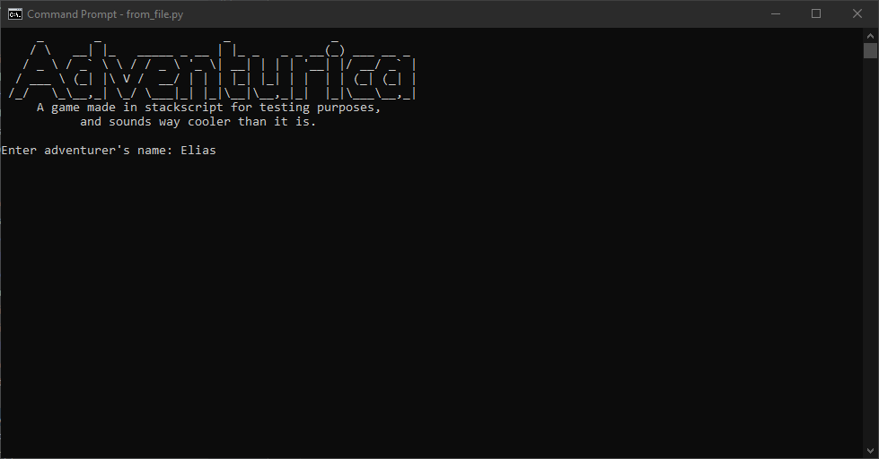
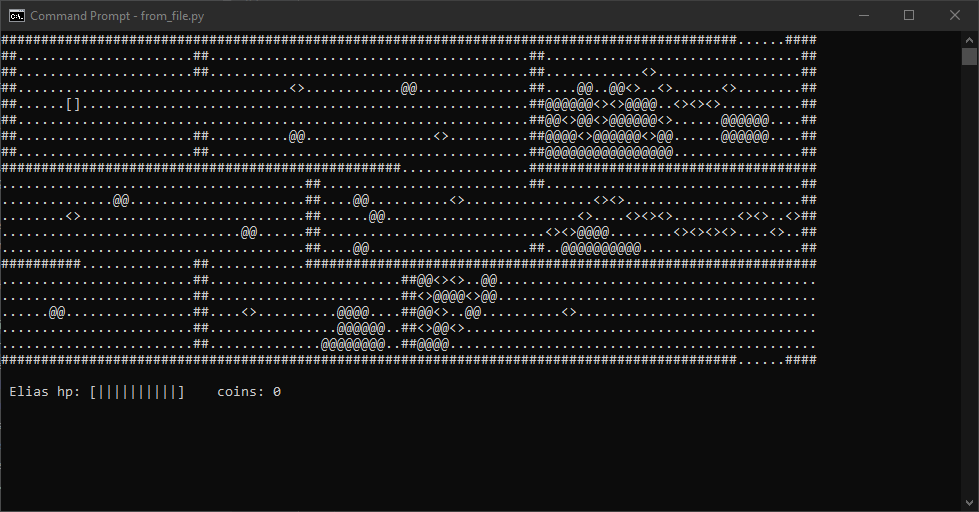
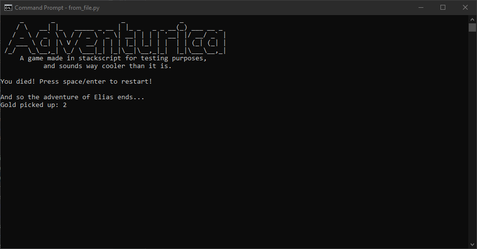

# Examples
###### Go back to [README](../README.md).
A random list of examples coded in stackscript. This is neither complete nor bug free,
but may provide some insight.

To run a file, execute [from_file.py](../from_file.py), inputting the correct file name.

[view directory](.)

- [breakreturncontinue.st](breakreturncontinue.st) A random assortment of breaks returns and continues
- [fileinteract.st](fileinteract.st) Reading, writing and appending to files
- [splitstr.st](splitstr.st) An implementation of splitting a str by token. Use `types :split` in code
- [power.st](power.st) Interactive power calculator
- [rule30.st](rule30.st) Implementation of [rule 30](https://mathworld.wolfram.com/CellularAutomaton.html).
- [game.st](game.st) :sparkles:Adventurica:sparkles: game

 

