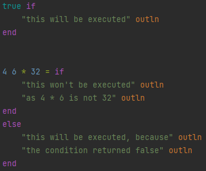
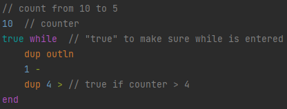
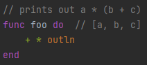

# Program Flow
###### Go back to [README](../../README.md).
###### Go back to [reference](../reference.md).
###### [Previous](structure_syntax_builtins.md) - [Next](variables_modules.md)

---

###### Go down to [If - Else](#If---Else).
###### Go down to [While](#While).
###### Go down to [Functions](#Functions).
###### Go down to [Function or Variable Pointers](#Function-or-Variable-Pointers).

---
#### Tip:
Pressing <kbd>Crtl</kbd>+<kbd>C</kbd> and then <kbd>Enter</kbd> in the console, will automatically
return you from any "indent" back to global scope.
### If - Else
###### Go to [top](#Program-Flow).

An `if` tests whether the topmost value of the stack is `true`. If yes, the if-scope is entered. 
Scopes are ended by using the keyword `end`. Optionally, you can add an `else`...`end` block 
directly after the `if`...`end`. Any operations between the if and else will not work.



```
true if
    "this will be executed" outln
end


4 6 * 32 = if
    "this won't be executed" outln
    "as 4 * 6 is not 32" outln
end
else
    "this will be executed, because" outln
    the condition returned false" outln
end
```
Make sure all paths in/around if/else/etc return the "same state" of stack (aka length and types), so your program can function
regardless which path is taken.

#### Tip:
You can see in which scope you are in the console by counting the number of dots after the `#`.
Every two dots represent one "indent" or "scope". An `end` always removes two dots.
If you are in "global" scope, ending will result in an error.

```
// in console:
# if
#.. "foo" outln
#.. "bar" outln
#.. end
[]
#
```
---
###While
###### Go to [top](#Program-Flow).
While loops work similar to ifs. To be entered, the topmost value on the stack has to be `true` and after the end of
each body execution, the top of the stack is checked. `false` will exit the `while`, `true` will return to the top. 



```
// count from 10 to 5
10  // counter
true while  // "true" to make sure while is entered
    dup outln
    1 -
    dup 4 > // true if counter > 4
end
```
---

###Functions
###### Go to [top](#Program-Flow).

Function and [variable](variables_modules.md#variables) names may use the [python variable naming rules](https://www.w3schools.com/python/gloss_python_variable_names.asp):
- a-z, A-Z, 0-9 and _
- has to start with a non-number character
- no whitespaces/special characters/etc

Functions start with the keyword `func`, then the name, then the keyword `do` and just like ifs, end with the keyword `end`.
As with everything, the indent or line is purely aesthetically and can be written with any number
of newlines or whitespaces.



```
// prints out a * (b + c)
func foo do  // [a, b, c]
    + * outln
end
```
```
// in console:
# 2 4 6 foo
20
[]
#
```
#### Note:
`foo` and `bar` is woodoo magic, or so i am told /j
#### Tip:
Pressing <kbd>Enter</kbd> after `func` or the function name will show a different sign than the hashtag
on the left: `+` representing the requirement of providing a name and `.` requiring the keyword `do`.
The `+` also shows up during interactions with [variables](variables_modules.md#variables) when a variable name is required. 
```
// in console:
# func
+.. bar
... do
#.. "I'm in bar" outln
#.. end
[]
# bar
I'm in bar
[]
#
```
---

### Function or Variable Pointers
###### Go to [top](#Program-Flow).
Learn more about [variables](variables_modules.md#variables) here.
